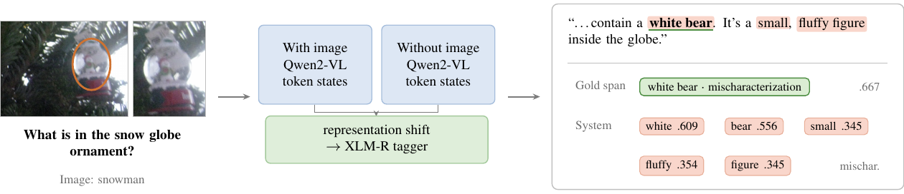
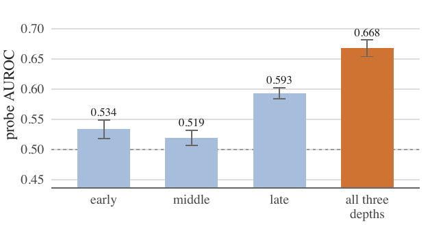

<h1>USP at SHROOM-Visions 2026</h1>

<p>
<b>Why Informative Proxy Visual Signals Do Not Localize Hallucinated Spans</b><br>
Rafael Macário Fernandes · Department of Linguistics, University of São Paulo
</p>

<p>


</p>

---

Mark the exact characters a vision–language model hallucinated, in English, French,
Italian and Chinese. The generating model is withheld, so every model-derived
signal is a **proxy**. We built a multilingual XLM-R token tagger and asked what
three proxy visual signals add to it.

The answer is almost nothing — and the interesting part is *why*.



<sub>A proxy LVLM reads the response twice, with and without the image. The shift
between its token representations is concatenated to the tagger's own states.
Annotators mark two words, <i>white bear</i>, as a mischaracterization of the
snowman in the globe; the tagger finds the right region but spreads probability
over five tokens. Character-level scoring rewards the annotation, not the region.</sub>

## What we found

**1. The metric is almost entirely about span position.** Feed the organizers' own
scorer predictions carrying gold information in one component at a time:

| prediction | Cor | what it isolates |
|---|---|---|
| nothing at all | .258 | the floor |
| gold spans, **wrong** labels | .970 | labels contribute **0** to Cor |
| gold spans, gold labels | .970 | — confirms it |
| gold spans, graded probabilities | .988 | grading is worth **.018** |
| oracle sentence-level detector | .476 | perfect sentences ≠ spans |
| whole response when hallucinated | .262 | barely beats abstaining |

Two of those rows are not measurements but properties of the scorer's code: it
never reads the `label` field when computing Cor, and returns 0 for a constant
prediction.

**2. A signal can be genuinely informative and still buy nothing.** Caption
entailment separates annotated from clean sentences at AUROC .605 against a .533
surface baseline — and adds .002 Cor. That is exactly what the decomposition
predicts for anything constant within a sentence.

**3. Representation shift breaks that account, and we could not explain it.** The
probe is fine-grained and works in all four languages (macro AUROC .652), yet adds
.009 Cor. Neither granularity nor category mixture accounts for the gap.



<sub>No single depth of the proxy model is a strong detector; combining three
exceeds the best single depth by .075 AUROC. The signal is distributed across
layers.</sub>

## Results

Test-set Cor per language, and all three official metrics averaged. Every value is
an official leaderboard score.

| system | EN | FR | IT | ZH | Cor | IoU | Cor+Lbl |
|---|---|---|---|---|---|---|---|
| empty submission | .253 | .255 | .263 | .365 | .284 | — | — |
| XLM-R base | .315 | .346 | .407 | .411 | .370 | .312 | .304 |
| XLM-R large | .343 | .389 | .400 | .386 | .380 | .324 | .312 |
| + representation shift ‡ | .346 | .389 | .413 | .406 | .389 | .332 | **.320** |
| + caption entailment | .338 | .389 | **.421** | .415 | .391 | .334 | .318 |
| + BIO output | .336 | **.394** | .416 | **.422** | **.392** | **.335** | .309 |
| tokenizer ceiling | .928 | .925 | .938 | .948 | .935 | — | — |

‡ submitted system. The three official metrics disagree about which configuration
is best — Cor and IoU peak at BIO, label-aware correlation at representation shift.

## Which file produced which result

| row | leaderboard id | code | executed record |
|---|---|---|---|
| XLM-R base | `xlmr-base-textonly-v1` | `src/01_span_tagger.py` | none |
| XLM-R large | `xlmr-large-textonly-v2` | `notebooks/run_span_tagger_kaggle.ipynb` | yes, 13/13 cells |
| + repr shift | `xlmr-large-visual-v3` | `notebooks/master_kaggle_all_stages.ipynb`, cell *FUSED TAGGER* | none |
| + caption NLI | `xlmr-large-visnli-v4` | `notebooks/master_kaggle_all_stages.ipynb`, cell *FINAL TAGGER* | none |
| + BIO output | `xlmr-large-bio-v5` | `notebooks/run_bio_tagger_colab.ipynb` | yes, with output |

Configuration differs between base and large: base at lr 2e-5, batch 16, three
epochs; every large row at lr 1e-5, batch 8, five epochs, with embeddings frozen
in the fused and BIO rows.

## Layout

```
notebooks/   the runs, with their output where it survives
src/         the pipeline as scripts, numbered in run order
analysis/    figure data, the R script, the token-type probe
figures/     the paper figures
tests/       end-to-end smoke test
```

| notebook | what it is |
|---|---|
| `master_kaggle_all_stages.ipynb` | The full Kaggle notebook: tagger, both probes, captioning, NLI features, both fused taggers, adjudication. Complete source for rows 1–4. Saved with outputs cleared. |
| `run_span_tagger_kaggle.ipynb` | XLM-R large text-only, executed, with training loss and development scores. |
| `run_probes_kaggle.ipynb` | Executed. Output-likelihood features (all near chance) and the representation-shift probe, including token-split vs response-split. |
| `run_bio_tagger_colab.ipynb` | The BIO run on Colab, executed, with development scores. |
| `draft_*_unrun.ipynb` | Early base-model drafts. `execution_count` empty on every cell — never run, kept for provenance. |

`src/alignment.py` holds the character/token conversion, the one place information
can silently leak away; `src/scoring.py` wraps the organizers' scorer unmodified.

## Running it

```bash
pip install -r requirements.txt
python tests/smoke_test.py          # whole tagger on CPU with a random encoder
```

Figures and analyses:

```bash
python analysis/export_fig_data.py
Rscript  analysis/fig_probe.R        # ACCENT at the top sets the highlight colour
python analysis/probe_token_type.py  # probe restricted to content tokens
```

Steps 3 and 4 of the pipeline need a GPU; everything else runs on CPU.

## Data and weights

Neither is included. The dataset and participant kit belong to the task
organizers and the images are not redistributed — point `DISTRIB` in
`src/01_span_tagger.py` at your own copy. Extracted features are ~275 MB and
derived from that data.

No checkpoints are published: training ran on Kaggle and Colab, and the weights
were not retained.

## Citation

```bibtex
@inproceedings{fernandes2026usp,
  title     = {USP at SHROOM-Visions: Why Informative Proxy Visual Signals
               Do Not Localize Hallucinated Spans},
  author    = {Fernandes, Rafael Mac\'ario},
  booktitle = {Proceedings of SHROOM-Visions 2026},
  year      = {2026}
}
```

MIT licensed.
